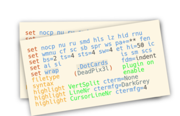

# .dotcards
 

Keep your Dotfiles with you. Always.

Dotcards are just dotfiles, but smaller.
Small enought to fit on a business card in fact!
Obviously this comes with drawbacks. You cant fit all
the bells and whistles on a business card, so you have
to compromise a bit.

### Why?

I'm frequently on new machines, offline environments, or
in other weird situations where fetching my dotfiles from
GitHub is just not an option. or at least not a good one.

So I have to resort to handjamming it in. Because of this,
I boiled my dotfiles down to a "minimum bearable configuration."
You can see evidence of this on my Github Pages blog series, FINMB.
But, I found that I would slowly add more features to that oneliner.
I missed Syntax highlighting, and some highlighting changes that made sense.
It was no longer a one liner. How to fix this? How about a slightly larger
mini-dotfile. Its not the hundred line monster, but its got a few more bells
and whistles than the "minimum bearable configuration." Lets call it the
"Minimum enjoyable configuration", its not everything, but its more fun.

This idea of printing out a business card with a dotfile on it, has another
benefit. When coworkers or friends or even strangers ask things like
"How do you make it do that?!" I dont have to give a long winded answer. Or
tell them "check out my dotfiles on github" (which i know they never will).
I can reach into my wallet and give them a card. Easier for everyone.
And its a lot easier than trying to remember an insane one liner.

### Specs

So how big is a business card? 2in x 3.5in.
By my testing (feel free to do you own), this comfortably fits:

    10 lines, 33 characters each in Courier New 12pt font.

If you need more than that, you can reduce the size:

    12 lines, 50 characters each, Courier New 8pt

But this gets a bit hard to read and I prefer not to.
Obviously you can double that for 2 sided cards.
Why Courier New? Because its a nice looking, widely available,
monospaced, sans-serif font. Feel free to use whatever you want.
But thats what my standards are based on.

